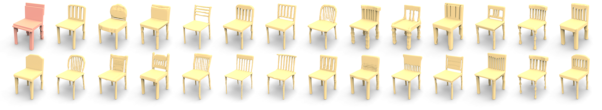

# DECOR-GAN
PyTorch 1.5 implementation for paper [DECOR-GAN: 3D Shape Detailization by Conditional Refinement](https://arxiv.org/abs/2012.09159), [Zhiqin Chen](https://czq142857.github.io/), [Vladimir G. Kim](http://www.vovakim.com/), [Matthew Fisher](https://techmatt.github.io/), [Noam Aigerman](https://noamaig.github.io/), [Hao Zhang](http://www.cs.sfu.ca/~haoz/), [Siddhartha Chaudhuri](https://www.cse.iitb.ac.in/~sidch/).

### [Paper](https://arxiv.org/abs/2012.09159)  |   [Oral video](?)  |   [GUI demo video](https://youtu.be/xIQ0aslpn8g)



## Citation
If you find our work useful in your research, please consider citing:

	@article{chen2021decor,
	  title={DECOR-GAN: 3D Shape Detailization by Conditional Refinement},
	  author={Zhiqin Chen and Vladimir G. Kim and Matthew Fisher and Noam Aigerman and Hao Zhang and Siddhartha Chaudhuri},
	  journal={Proceedings of IEEE Conference on Computer Vision and Pattern Recognition (CVPR)},
	  year={2021}
	}

## Dependencies
Requirements:
- Python 3.6 with numpy, h5py, scipy, sklearn and Cython
- [PyTorch 1.5](https://pytorch.org/get-started/locally/) (other versions may also work)
- [PyMCubes](https://github.com/pmneila/PyMCubes) (for marching cubes)
- [OpenCV-Python](https://opencv-python-tutroals.readthedocs.io/en/latest/) (for reading and writing images)

Build Cython module:
```
python setup.py build_ext --inplace
```

## Datasets and pre-trained weights
For data preparation, please see [data_preparation](https://github.com/czq142857/DECOR-GAN/tree/master/data_preparation).

We provide the ready-to-use datasets here.

- [DECOR_GAN_data.zip](https://drive.google.com/file/d/1rBqRrVnQ0kM5wCpDmrVUDeH2N35drLdL/view?usp=sharing)

Backup links:

- [DECOR_GAN_data.zip](https://pan.baidu.com/s/134IlCc6S3PJGTHQxPVy5eA) (pwd: 1234)

We also provide the pre-trained network weights.

- [DECOR_GAN_checkpoint.zip](https://drive.google.com/file/d/1FFvfHbVTrX5tFEil1W-3gfF3FeY76thb/view?usp=sharing)

Backup links:

- [DECOR_GAN_checkpoint.zip](https://pan.baidu.com/s/1YHxJESG3Zg2EHPupV2_PAA) (pwd: 1234)


## Training

To train the network:
```
python main.py --data_style style_chair_64 --data_content content_chair_train --data_dir ./data/03001627/ --alpha 0.5 --beta 10.0 --input_size 32 --output_size 128 --train --gpu 0 --epoch 20
python main.py --data_style style_plane_32 --data_content content_plane_train --data_dir ./data/02691156/ --alpha 0.1 --beta 10.0 --input_size 64 --output_size 256 --train --gpu 0 --epoch 20
python main.py --data_style style_car_32 --data_content content_car_train --data_dir ./data/02958343/ --alpha 0.2 --beta 10.0 --input_size 64 --output_size 256 --train --gpu 0 --epoch 20
python main.py --data_style style_table_64 --data_content content_table_train --data_dir ./data/04379243/ --alpha 0.2 --beta 10.0 --input_size 16 --output_size 128 --train --gpu 0 --epoch 50
python main.py --data_style style_motor_16 --data_content content_motor_all_repeat20 --data_dir ./data/03790512/ --alpha 0.5 --beta 10.0 --input_size 64 --output_size 256 --train --asymmetry --gpu 0 --epoch 20
python main.py --data_style style_laptop_32 --data_content content_laptop_all_repeat5 --data_dir ./data/03642806/ --alpha 0.2 --beta 10.0 --input_size 32 --output_size 256 --train --asymmetry --gpu 0
python main.py --data_style style_plant_20 --data_content content_plant_all_repeat8 --data_dir ./data/03593526_03991062/ --alpha 0.5 --beta 10.0 --input_size 32 --output_size 256 --train --asymmetry --gpu 0
```
Note that *style_chair_64* means the model will be trained with 64 detailed chairs. You can modify the list of detailed shapes in folder *splits*, such as *style_chair_64.txt*. You can also modify the list of content shapes in folder *splits*. The parameters *input_size* and *output_size* specify the resolutions of the input and output voxels. Valid settings are as follows:
| Input resolution | Output resolution | Upsampling rate |
| ---------------- | ----------------- | --------------- |
| 64               | 256               | x4              |
| 32               | 128               | x4              |
| 32               | 256               | x8              |
| 16               | 128               | x8              |

## GUI application

To launch UI for a pre-trained model, replace *--data_content* to the testing content shapes and replace *--train* with *--ui*.
```
python main.py --data_style style_chair_64 --data_content content_chair_test --data_dir ./data/03001627/ --input_size 32 --output_size 128 --ui --gpu 0
```

## Testing

These are examples for testing a model trained with 32 detailed chairs. For others, please change the commands accordingly.


### Rough qualitative testing
To output a few detailization results (the first 16 content shapes x 32 styles) and a T-SNE embedding of the latent space:
```
python main.py --data_style style_chair_32 --data_content content_chair_test --data_dir ./data/03001627/ --input_size 32 --output_size 128 --test --gpu 0
```
The output images can be found in folder *samples*.


### IOU, LP, Div
To test Strict-IOU, Loose-IOU, LP-IOU, Div-IOU, LP-F-score, Div-F-score:
```
python main.py --data_style style_chair_64 --data_content content_chair_test --data_dir ./data/03001627/ --input_size 32 --output_size 128 --prepvoxstyle --gpu 0
python main.py --data_style style_chair_32 --data_content content_chair_test --data_dir ./data/03001627/ --input_size 32 --output_size 128 --prepvox --gpu 0
python main.py --data_style style_chair_64 --data_content content_chair_test --data_dir ./data/03001627/ --input_size 32 --output_size 128 --evalvox --gpu 0
```
The first command prepares the patches in 64 detailed training shapes, thus *--data_style* is *style_chair_64*. Specifically, it removes duplicated patches in each detailed training shape and only keep unique patches for faster computation in the following testing procedure. The unique patches are written to folder *unique_patches*. Note that if you are testing multiple models, you do not have to run the first command every time -- just copy the folder *unique_patches* or make a symbolic link.

The second command runs the model and outputs the detailization results, in folder *output_for_eval*.

The third command evaluates the outputs. The results are written to folder *eval_output* ( *result_IOU_mean.txt*, *result_LP_Div_Fscore_mean.txt*, *result_LP_Div_IOU_mean.txt* ).


### Cls-score
To test Cls-score:
```
python main.py --data_style style_chair_64 --data_content content_chair_all --data_dir ./data/03001627/ --input_size 32 --output_size 128 --prepimgreal --gpu 0
python main.py --data_style style_chair_32 --data_content content_chair_test --data_dir ./data/03001627/ --input_size 32 --output_size 128 --prepimg --gpu 0
python main.py --data_style style_chair_64 --data_content content_chair_all --data_dir ./data/03001627/ --input_size 32 --output_size 128 --evalimg --gpu 0
```
The first command prepares rendered views of all content shapes, thus *--data_content* is *content_chair_all*. The rendered views are written to folder *render_real_for_eval*. Note that if you are testing multiple models, you do not have to run the first command every time -- just copy the folder *render_real_for_eval* or make a symbolic link.

The second command runs the model and outputs rendered views of the detailization results, in folder *render_fake_for_eval*.

The third command evaluates the outputs. The results are written to folder *eval_output* ( *result_Cls_score.txt* ).


### FID
To test FID-all and FID-style, you need to first train a classification model on shapeNet. You can use the provided pre-trained weights (*Clsshapenet_128.pth* and *Clsshapenet_256.pth* for 128<sup>3</sup> and 256<sup>3</sup> inputs). In case you need to train your own model, modify *shapenet_dir* in *evalFID.py* and run:
```
python main.py --prepFIDmodel --output_size 128 --gpu 0
python main.py --prepFIDmodel --output_size 256 --gpu 0
```

After you have the pre-trained classifier, use the following commands:
```
python main.py --data_style style_chair_64 --data_content content_chair_all --data_dir ./data/03001627/ --input_size 32 --output_size 128 --prepFIDreal --gpu 0
python main.py --data_style style_chair_32 --data_content content_chair_test --data_dir ./data/03001627/ --input_size 32 --output_size 128 --prepFID --gpu 0
python main.py --data_style style_chair_64 --data_content content_chair_all --data_dir ./data/03001627/ --input_size 32 --output_size 128 --evalFID --gpu 0
```
The first command computes the mean and sigma vectors for real shapes and writes to *precomputed_real_mu_sigma_128_content_chair_all_num_style_16.hdf5*. Note that if you are testing multiple models, you do not have to run the first command every time -- just copy the output hdf5 file or make a symbolic link.

The second command runs the model and outputs the detailization results, in folder *output_for_FID*.

The third command evaluates the outputs. The results are written to folder *eval_output* ( *result_FID.txt* ).


